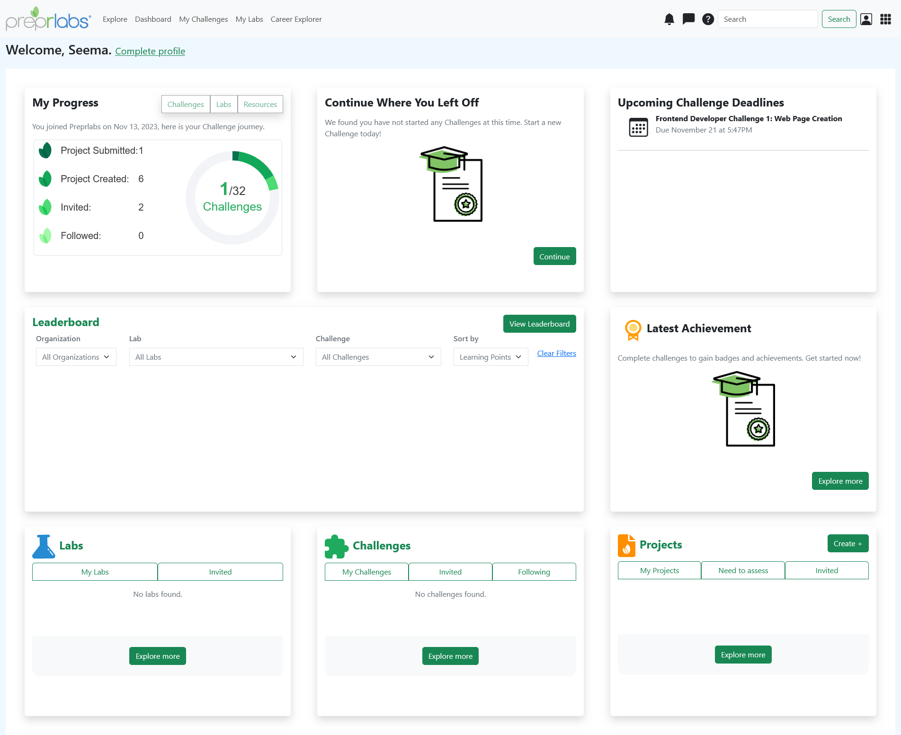
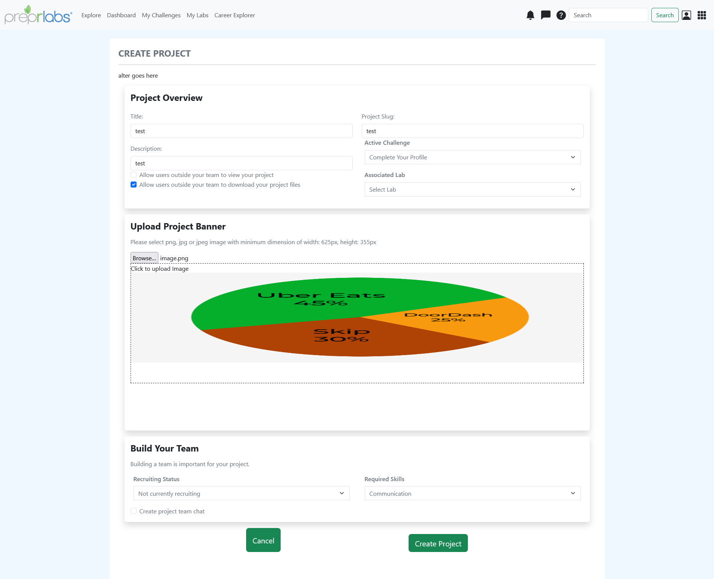
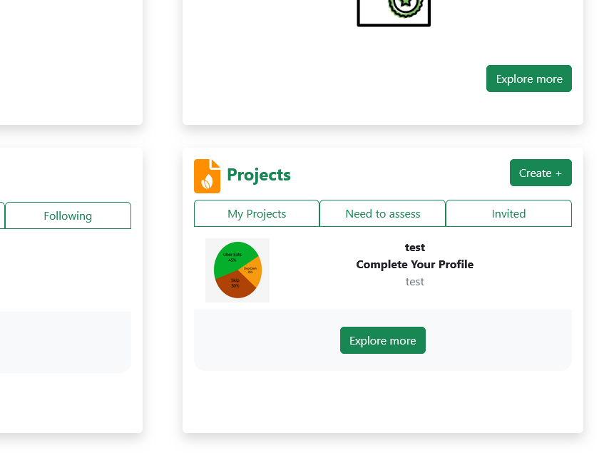

# Frontend-Developer-Challenge-3-Dashboard-and-Project-Creation
PreprLabs user Dashboard page and Create Project Page made with React, Redux, React Router, and Bootstrap.

Navigate to the Create Project page to fill out 10 fields + 1 project image banner. The newly created project will be rendered on the Dashboard Project section.

## Tech-Stack and Tools
- React
- Redux
- React-Router
- Bootstrap
- Visual Studio Code
- Git branching

## Screenshots
Dashboard Page

Create Project Page

Dashboard updated with new project
